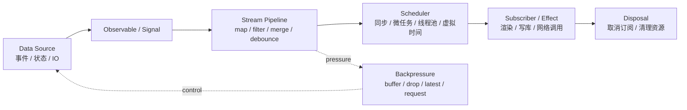
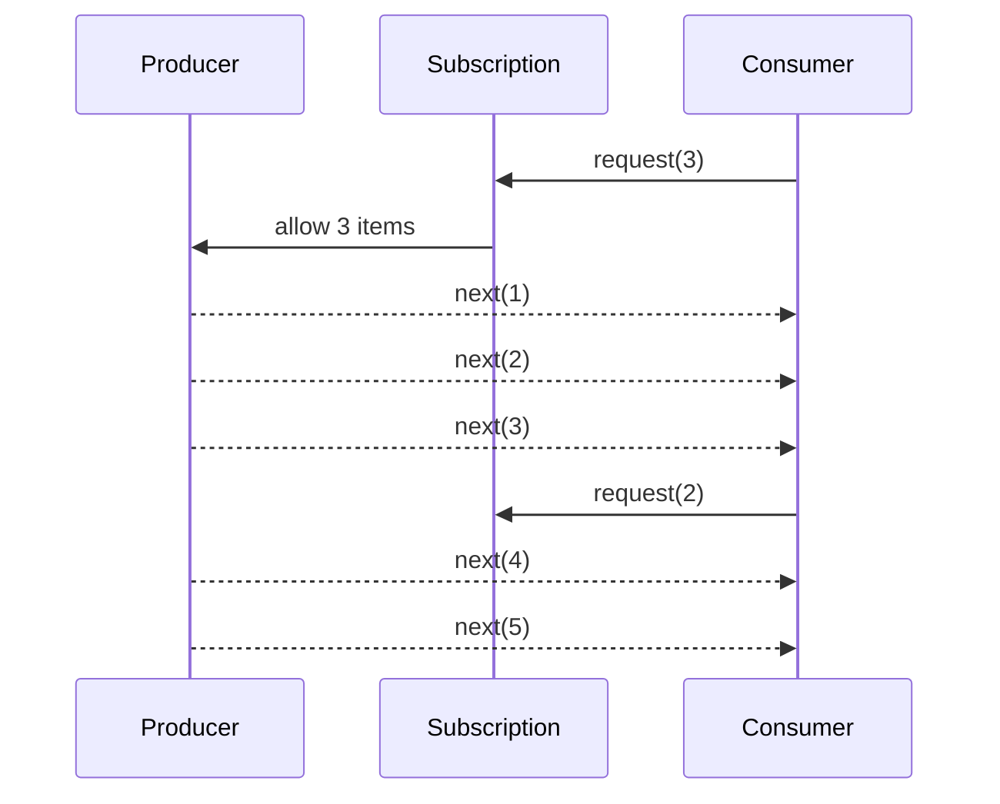

# Day 28｜Reactive System：暗色科技风响应式内核

> 在暗色终端的光标背后，响应式系统不是“某个框架的语法糖”，而是一套关于**变化如何被建模、传播、调度与约束**的工程方法。它把时间、依赖和副作用从杂乱的回调中抽离出来，让系统像一张带电的拓扑图：节点保存状态，边传递变化，调度器决定脉冲何时抵达。

本篇关注原理理解。目标不是立刻复刻 RxJava 或 Reactor 的完整能力，也不是停留在前端框架的 `state` API，而是从响应式系统的核心思想出发，拆解 Observable、Stream、Backpressure、Scheduler 等关键概念，比较经典实现的取舍，并设计一个可以亲手实现的最小响应式原型。

---

## 1. 核心思想：把“变化”变成一等公民

传统命令式代码常常以“现在去读什么值”为中心：

```js
const total = price * count
console.log(total)
```

这里的 `total` 是一次性计算结果。如果 `price` 或 `count` 后续变化，`total` 不会自动更新。开发者必须自己找到所有依赖点，然后手动重新计算。这种模型在小程序中足够清晰，但当系统出现异步事件、用户输入、网络响应、缓存失效、并发任务和 UI 重绘时，“谁依赖谁”“什么时候更新”“重复更新能否合并”会迅速失控。

响应式系统的核心思想是：**不只描述当前值，也描述值随时间变化的关系**。一个值不再只是内存中的静态单元，它可能是事件序列、异步结果、计算节点，或者一个会触发订阅者的信号源。

可以把它理解为三层：

1. **数据源层**：变化从哪里来，例如用户点击、定时器、WebSocket、数据库变更、状态变量。
2. **依赖图层**：变化会影响哪些计算，例如 `computed`、`map`、`filter`、`combineLatest`。
3. **执行层**：变化何时执行、在哪执行、是否合并、如何取消、如何处理速度不匹配。

一个成熟响应式系统的难点不在于“值变了就通知一下”，而在于保证通知过程可组合、可取消、可调度、可测试，并在压力下保持可控。

---

## 2. 响应式拓扑：从源到订阅者



这张图表达了响应式系统最基本的运行路线：数据源发出变化，Observable 或 Signal 把变化抽象成可订阅对象，Stream Pipeline 对变化做变换与组合，Scheduler 决定执行时机，Subscriber 或 Effect 执行最终副作用，而 Disposal 负责在生命周期结束时切断连接。

在暗色科技风的系统想象中，响应式架构像一块低亮度的控制面板：每个节点都是一个发光端口，每条边都是一束可观测的数据脉冲。真正的工程价值来自这块面板的可推理性：你能知道电流从哪里来，到哪里去，拥塞时怎么限流，故障时怎么熔断。

---

## 3. Observable：可被观察的变化源

Observable 是响应式编程中最经典的抽象之一。它表示“一个可被订阅的值或事件序列”。订阅者通常会接收三类信号：

- `next(value)`：产生一个新值。
- `error(reason)`：序列失败。
- `complete()`：序列结束。

这个三元协议看似简单，却解决了异步编程中的一个核心问题：异步结果不一定只有一次，也不一定永远成功，还可能需要明确结束。

Observable 有两个重要维度：

**Cold Observable**：每个订阅者都会触发独立的数据生产过程。例如 HTTP 请求、文件读取、按需计算。它像一段尚未运行的脚本，谁订阅，谁启动。

**Hot Observable**：数据源独立于订阅者存在。例如鼠标移动、股票行情、传感器数据、广播事件。订阅者只能从加入之后开始接收，不会自动拿到历史。

这一区别非常关键。很多响应式系统的 bug 来自误判冷热属性：开发者以为一个流“订阅后才开始”，实际它早已在后台发射；或者以为多个订阅者共享一次请求，实际每次订阅都重复触发了 IO。

---

## 4. Stream：带时间维度的数据结构

Stream 可以理解为“随时间展开的集合”。数组是空间集合，Stream 是时间集合。

```txt
Array:  [1, 2, 3, 4]
Stream: --1---2---3---4--->
```

数组可以 `map`、`filter`、`reduce`，Stream 也可以。但 Stream 的复杂之处在于值不是一次性全部存在，而是逐步到达。因此它的操作符不仅处理数据，还处理时间：

- `map`：把每个值转换为另一个值。
- `filter`：只允许满足条件的值继续传播。
- `merge`：把多个流合并为一个流。
- `switchMap`：当新任务到来时取消旧任务，常用于搜索框请求。
- `debounce`：等待一段安静时间后再发射，常用于输入防抖。
- `throttle`：限制发射频率，常用于滚动和拖拽。
- `combineLatest`：多个流都至少产生一次值后，组合它们的最新值。

Stream 的真正威力是可组合性。复杂异步流程不再由嵌套回调表达，而是由一串可读的管道表达：

```js
searchText$
  .debounce(300)
  .filter(text => text.length > 1)
  .switchMap(text => fetchResult(text))
  .subscribe(renderResult)
```

这段代码表达的是一种时间逻辑：输入变化后不要立刻请求，等待 300ms；太短的输入不请求；新请求出现时取消旧请求；结果到达后渲染。响应式的价值不是让代码更炫，而是让时间行为显式化。

---

## 5. Backpressure：当生产者比消费者更快

Backpressure 是响应式系统从玩具走向工程系统的分界线。只要存在流，就会出现速度不匹配：生产者持续发射，消费者来不及处理。典型场景包括日志洪峰、消息队列堆积、网络包到达、UI 高频事件、数据库批量写入。

如果没有背压策略，系统通常会滑向三种失败：

- 内存被缓冲区耗尽。
- 延迟不断累积，用户看到过期结果。
- CPU 被无效任务占满，真正重要的任务无法执行。

常见背压策略包括：

- **Buffer**：先缓存，适合短暂峰值，但必须设置上限。
- **Drop**：丢弃部分事件，适合高频但可损失的数据，例如鼠标移动。
- **Latest**：只保留最新值，适合状态展示，例如进度条。
- **Window / Batch**：按时间或数量分批处理，适合日志、埋点、批量写库。
- **Demand / request(n)**：消费者明确告诉生产者还能接收多少，这是 Reactive Streams 规范的核心。

背压的本质是把“系统承受能力”反馈给上游。没有反馈的流只是瀑布；有反馈的流才是管道。



---

## 6. Scheduler：控制变化何时发生

Scheduler 是响应式系统中常被低估的部分。没有调度器，响应式只是同步通知；有了调度器，响应式系统才能跨越线程、事件循环、动画帧和虚拟时间。

Scheduler 负责回答几个问题：

- 当前任务是立即执行，还是排队执行？
- 是在调用栈内同步执行，还是放入微任务？
- UI 更新应该进入 `requestAnimationFrame`，还是进入普通任务队列？
- IO 密集任务和 CPU 密集任务是否应该使用不同线程池？
- 测试中能否使用虚拟时间模拟 5 分钟后的结果？

在前端系统里，Scheduler 常常决定一次状态变化是否会造成多次渲染。优秀的实现会把连续变化合并到一个刷新周期中，避免重复计算。在后端系统里，Scheduler 决定任务在哪个线程上执行，也决定阻塞代码是否会污染非阻塞链路。

可以把 Scheduler 看成响应式系统的“黑色时钟”：它不产生业务数据，却决定每个脉冲的节拍。

---

## 7. Signals：值级响应式与依赖追踪

Observable 更擅长表达事件序列，Signal 更擅长表达“当前值及其依赖关系”。一个 Signal 通常具备：

- `get()`：读取当前值。
- `set(value)`：写入新值并通知依赖。
- `computed(fn)`：声明派生值。
- `effect(fn)`：声明副作用，当依赖变化时重新执行。

Signal 的关键技术是**自动依赖收集**。当 `effect` 执行时，系统设置一个全局或上下文级的“当前观察者”。在执行过程中，如果读取了某个 Signal，这个 Signal 就把当前观察者记录为依赖者。之后 Signal 更新时，便能精准通知相关 effect。

```js
const price = signal(20)
const count = signal(2)
const total = computed(() => price.get() * count.get())

effect(() => {
  console.log(total.get())
})
```

这段代码的核心不是 `console.log`，而是依赖关系被运行时捕获：`total` 依赖 `price` 和 `count`，`effect` 依赖 `total`。当 `count` 变化时，系统只需要重新计算受影响的节点。

---

## 8. 经典实现对比

| 实现 | 核心抽象 | 典型场景 | 背压能力 | 调度模型 | 设计取舍 |
|---|---|---|---|---|---|
| RxJava | `Observable` / `Flowable` / `Single` | JVM 异步流、事件组合、复杂操作符管道 | `Flowable` 支持背压 | 多种 Scheduler，适配线程池 | 操作符极丰富，学习曲线较陡 |
| Reactor | `Flux` / `Mono` | Spring WebFlux、非阻塞服务端、Reactive Streams | 内建 `request(n)` 协议 | 与 Netty、线程模型深度结合 | 更偏服务端响应式管道 |
| RxJS | `Observable` | 前端事件、异步请求、复杂 UI 交互 | 背压更多依赖操作符策略 | event loop、animation frame、async scheduler | 对时间操作表达力很强 |
| Svelte Signals / Runes | `state` / `derived` / `effect` 思路 | UI 状态、组件内部依赖更新 | 通常不是流式背压模型 | 框架调度渲染更新 | 值级响应式，强调编译与运行时协作 |
| SolidJS Signals | `createSignal` / `createMemo` / `createEffect` | 精细粒度前端更新 | 不以背压为核心 | 同步依赖传播结合批处理 | 更新粒度小，依赖图清晰 |

RxJava 和 Reactor 更像“时间流处理引擎”，它们面对的是异步序列、线程切换、错误传播和背压控制。Signals 系统更像“依赖图刷新引擎”，它们面对的是状态变化、派生值缓存、精细粒度 UI 更新和副作用清理。

这两类系统并不冲突。Observable 适合描述事件从远方传来，Signal 适合描述当前世界的状态如何派生。实际工程中常常会把二者结合：网络事件进入 Stream，最终落入 Signal；Signal 驱动 UI，用户动作再转成 Stream。

---

## 9. 最小响应式原型：设计目标

我们可以先实现一个最小 Signal 风格系统，因为它更容易在一天内完成，也能揭示响应式系统最核心的依赖收集机制。目标不是完整框架，而是建立“变化传播”的骨架。

最小功能：

- `signal(initialValue)`：创建可读写状态。
- `effect(fn)`：自动追踪依赖，依赖变化后重新执行。
- `computed(fn)`：创建派生值，缓存计算结果。
- `batch(fn)`：批量更新，合并重复执行。
- `dispose()`：停止某个 effect，避免内存泄漏。

核心数据结构：

```txt
Signal {
  value: any
  subscribers: Set<Computation>
}

Computation {
  fn: Function
  deps: Set<Signal>
  disposed: boolean
  dirty: boolean
}
```

运行时需要维护一个 `activeComputation`。当 effect 或 computed 执行时，把它设置为当前计算节点；当 Signal 被读取时，如果存在当前计算节点，就建立双向关系：

- Signal 记录这个 Computation 是订阅者。
- Computation 记录自己依赖这个 Signal。

这种双向记录非常重要。因为下一次重新执行 effect 前，必须先清理旧依赖，否则条件分支会导致幽灵订阅。

```js
effect(() => {
  if (enabled.get()) {
    console.log(name.get())
  }
})
```

当 `enabled` 从 `true` 变为 `false` 后，effect 不再读取 `name`。如果不清理旧依赖，`name` 后续变化仍会触发 effect，这就是依赖图污染。

---

## 10. 原型执行流程

```mermaid
flowchart TD
    A[effect(fn)] --> B[创建 Computation]
    B --> C[清理旧 deps]
    C --> D[设置 activeComputation]
    D --> E[执行 fn]
    E --> F{读取 signal?}
    F -- 是 --> G[建立 Signal 与 Computation 依赖]
    F -- 否 --> H[恢复 activeComputation]
    G --> E
    H --> I[等待 signal.set]
    I --> J[标记订阅者 dirty]
    J --> K[进入调度队列]
    K --> L[flush 队列并重新执行]
```

一个简化实现可以这样思考：

```js
let activeComputation = null
const queue = new Set()
let flushing = false

function schedule(comp) {
  if (comp.disposed) return
  queue.add(comp)
  if (!flushing) {
    flushing = true
    queueMicrotask(flush)
  }
}

function flush() {
  for (const comp of queue) {
    queue.delete(comp)
    runComputation(comp)
  }
  flushing = false
}
```

这里使用 `Set` 的原因是天然去重：同一个 effect 在一个微任务周期内被多个 Signal 触发，也只需要重新执行一次。这就是最早级别的调度优化。

---

## 11. 错误、清理与一致性

最小原型最容易忽略三个问题。

第一是错误传播。`effect` 执行时可能抛错。简单实现可以让错误冒泡，但工程系统通常需要错误边界，否则一个 effect 失败可能破坏整个刷新队列。

第二是清理函数。副作用常常会注册外部资源，例如事件监听、定时器、WebSocket。下一次 effect 重新执行前，应该先执行上一次返回的清理函数。

```js
effect(() => {
  const id = setInterval(tick, 1000)
  return () => clearInterval(id)
})
```

第三是一致性。假设 `a` 和 `b` 同时变化，而 `total = a + b`。如果没有 batch，effect 可能看到中间状态。批处理的目标就是让一组同步变更在逻辑上成为一次提交，订阅者只观察到最终稳定状态。

---

## 12. 从最小原型走向完整系统

当最小 Signal 系统跑通后，可以沿着四条路线扩展。

**路线一：从 Signal 到 Stream。** 增加 `observable(subscribe)`，实现 `map`、`filter`、`take`、`debounce` 等操作符。理解事件序列和当前值模型的差异。

**路线二：加入取消协议。** 每次订阅返回 `unsubscribe()`，每个操作符都必须把取消向上游传递。取消是响应式系统的资源安全底线。

**路线三：加入背压。** 为 Stream 增加简单的缓冲上限和丢弃策略，再尝试实现 `request(n)`。这会让你理解 Reactor 和 Reactive Streams 为什么需要更严格的协议。

**路线四：加入 Scheduler 抽象。** 把同步执行、微任务执行、宏任务执行、动画帧执行封装成不同 scheduler。测试时使用虚拟时间，避免真的等待。

---

## 13. 今日实践清单

- 画出一个状态到 UI 的依赖图，标明源、派生值和副作用。
- 实现 `signal`、`effect`、依赖收集和依赖清理。
- 使用调度队列合并同一轮重复更新。
- 增加 `computed`，观察缓存和脏标记如何工作。
- 为 effect 增加 cleanup 和 dispose。
- 写一个输入框搜索示例，比较 Signal 模型和 Stream 模型的表达差异。

---

## 14. 总结：响应式不是自动更新，而是变化协议

响应式系统的表层体验是“数据变了，界面自动更新”。但更深层的本质是：系统用一套协议描述变化的产生、传播、组合、调度、取消和限速。

Observable 把未来到来的多个值封装成可订阅序列；Stream 让时间逻辑可以像集合操作一样组合；Backpressure 让系统在压力下仍能保持边界；Scheduler 让变化传播拥有可控节奏；Signals 则把当前值和依赖图连接起来，实现精细粒度更新。

当你能亲手实现一个最小响应式内核，就会发现许多框架魔法都可以被还原为朴素机制：读取时收集依赖，写入时通知订阅者，执行前清理旧关系，调度器合并重复任务，生命周期结束时释放资源。

暗色科技风的响应式系统不是闪烁的视觉效果，而是一种冷静的工程秩序：每一次变化都有来源，每一次传播都有路径，每一次副作用都有边界。
