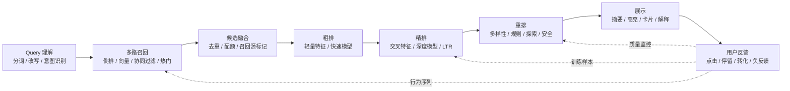

# Day 29｜Search / Recommendation Extension：暗色科技风搜索与推荐内核

> 在暗色终端的低亮光栅背后，搜索与推荐不是“调一下 Elasticsearch API”，也不是“套一个协同过滤库”，而是一套关于**信息如何被表示、召回、排序、解释与反馈**的工程方法。它把文本、向量、用户行为、物品属性和实时上下文接入同一条排序电路，让系统从海量候选中找到最可能匹配当前意图的结果。

本篇关注原理理解。目标不是立刻复刻 Elasticsearch、YouTube 推荐或淘宝推荐的完整复杂度，而是从信息检索、相似度计算、排序学习和用户意图理解出发，拆解倒排索引、向量空间、Learning to Rank、协同过滤、召回-粗排-精排漏斗等核心概念，并设计一个可以亲手实现的最小搜索原型。

---

## 1. 核心思想：从“查得到”到“排得准”

搜索和推荐解决的是同一个更大的问题：**在巨大的候选集合中，找到与当前需求最相关的一小部分，并按照价值排序**。

二者的入口不同。搜索通常由用户显式输入 `query`，系统要理解关键词、语义、约束和排序意图；推荐通常没有明确查询词，系统要从用户历史、上下文、物品画像和群体行为中推断“此刻可能需要什么”。

但它们在工程链路上高度相似：

1. **表示**：把文本、物品、用户和上下文转换成可计算的特征。
2. **召回**：从千万级或亿级候选中快速取出一批可能相关的结果。
3. **排序**：用更复杂的特征和模型判断候选之间的优先级。
4. **重排**：加入多样性、业务规则、去重、探索和安全约束。
5. **反馈**：把点击、停留、购买、跳出、隐藏等行为回流到下一轮系统中。

最朴素的搜索可以只是字符串匹配，最朴素的推荐可以只是热门榜。但真正的搜索与推荐内核必须处理三个难题：

- **规模**：候选集合太大，不能逐个精确计算。
- **语义**：用户表达与内容表达经常不一致。
- **排序**：相关性不是二元判断，而是多目标权衡。

所以工程系统不能只问“有没有这个词”，还要问“这个词有多重要”“这个用户现在想要什么”“哪些候选值得进入下一层模型”“最终展示是否足够稳定、公平、多样和可解释”。

---

## 2. 倒排索引：搜索系统的黑色线缆

倒排索引是全文搜索的基础结构。它不再按文档查词，而是按词查文档。

```txt
正排结构：
doc_1 -> 深度学习 推荐 系统
doc_2 -> 搜索 引擎 倒排 索引
doc_3 -> 推荐 系统 召回 排序

倒排结构：
推荐 -> doc_1, doc_3
系统 -> doc_1, doc_3
搜索 -> doc_2
倒排 -> doc_2
```

倒排索引通常不只保存文档编号，还会保存更多统计信息：

- 词项在文档中的出现次数。
- 词项出现的位置，用于短语查询和高亮。
- 词项所在字段，例如标题、正文、标签。
- 文档长度、字段权重、更新时间、质量分等辅助特征。

这让搜索系统可以快速回答：“哪些文档包含这些词？”然后再进一步计算相关性分数。

倒排索引像暗色机房里的主干线缆：它不负责最终智能判断，却负责把候选结果以极低延迟送到排序模块。如果没有倒排索引，全文搜索就会退化为扫描所有文档，规模一大便无法接受。

---

## 3. 向量空间：把语义投影到坐标系

倒排索引擅长处理词面匹配，但它对语义相近、表达不同的内容并不天然敏感。例如用户搜索“笔记本续航好”，相关文档可能写的是“电池容量大”“轻办公使用十小时”“低功耗处理器”。这些内容未必共享相同关键词。

向量空间模型把文本、用户或物品表示成高维向量。相似度计算就变成向量之间的距离或夹角。

常见相似度包括：

- **余弦相似度**：关注方向是否接近，常用于文本向量。
- **内积相似度**：常用于推荐召回，分数越高表示匹配越强。
- **欧氏距离**：常用于空间距离意义明确的向量表示。

```txt
query = [0.12, 0.83, 0.21, ...]
doc_a = [0.10, 0.79, 0.25, ...]
doc_b = [0.91, 0.04, 0.33, ...]

cosine(query, doc_a) > cosine(query, doc_b)
```

向量化让系统可以从“字面匹配”进入“语义匹配”。但代价是检索方式改变了：不能再只依赖倒排表，还需要近似最近邻索引来快速寻找相近向量。

---

## 4. 排序学习：让相关性成为可训练目标

传统搜索中的排序公式往往由人工设计，例如 TF-IDF、BM25、字段权重、时间衰减和质量分相加。排序学习则把排序问题转化为机器学习问题，让模型从历史反馈中学习“什么结果更应该排在前面”。

排序学习通常有三种建模方式：

- **Pointwise**：把每个候选单独打分，例如预测点击率或相关性等级。
- **Pairwise**：学习两个候选之间谁应该排得更靠前。
- **Listwise**：直接优化整个结果列表的排序质量。

一个排序模型可能使用这些特征：

- Query 特征：分词、意图、长度、类目、改写结果。
- 文档特征：标题匹配、正文匹配、发布时间、质量分、权威度。
- 用户特征：历史偏好、地理位置、设备、会员状态。
- 交叉特征：用户与物品的历史交互、query 与标题相似度、类目匹配度。
- 上下文特征：时间、场景、入口、实时热点。

排序学习的价值不只是“模型更复杂”，而是它把搜索与推荐从固定公式推进到可迭代系统。每一次点击、跳出、收藏、购买和负反馈，都可能成为下一版排序模型的训练信号。

---

## 5. 协同过滤 vs 内容推荐

推荐系统常见两条路线：协同过滤和内容推荐。

**协同过滤**关注用户与物品之间的交互关系。它的基本假设是：行为相似的用户可能喜欢相似物品，或者被相似用户共同喜欢的物品可能具备相近吸引力。

```txt
用户 A 喜欢：电影 1、电影 2、电影 4
用户 B 喜欢：电影 1、电影 2

如果 A 与 B 行为相似，则可以把电影 4 推荐给 B。
```

**内容推荐**关注物品自身属性和用户画像之间的匹配。例如用户经常阅读“分布式系统”“数据库”“编译器”相关内容，系统可以推荐带有相似标签、文本向量或主题分布的新内容。

两者的取舍很明确：

| 方法 | 依赖信号 | 优点 | 局限 | 典型场景 |
|---|---|---|---|---|
| 协同过滤 | 用户-物品交互 | 能发现隐含兴趣，不强依赖内容理解 | 冷启动困难，热门偏置明显 | 电商、视频、音乐、社区内容 |
| 内容推荐 | 文本、标签、类目、图像、属性 | 可解释性强，适合新物品 | 容易越推越窄，难发现意外兴趣 | 新闻、知识库、商品冷启动 |
| 混合推荐 | 行为 + 内容 + 上下文 | 覆盖更完整，鲁棒性更高 | 系统复杂度高，调试成本高 | 大多数工业推荐系统 |

实际工程中很少只用一种方法。成熟系统通常会把协同过滤、内容相似、热门趋势、社交关系、地理位置和业务规则作为多路召回源，再交给排序模型统一比较。

---

## 6. 召回-粗排-精排漏斗

搜索与推荐系统通常不会让最复杂的模型直接扫描全部候选。原因很简单：候选规模太大，精排模型太贵。

因此工业系统常使用漏斗式架构：

1. **召回**：从全量物品中快速取回几百到几千个候选，强调覆盖率和速度。
2. **粗排**：用中等复杂度模型过滤候选，降低精排压力。
3. **精排**：用更复杂的模型进行细粒度排序。
4. **重排**：加入多样性、去重、规则、探索、频控和展示约束。

可以把它理解为一块多层筛网：上游宽而快，下游窄而准。越往后，候选越少，特征越丰富，模型越昂贵，排序越精细。

---

## 7. 完整链路：从意图到展示



这条链路表达了搜索与推荐系统的基本运行路线：先理解当前请求，再通过多种召回方式生成候选，随后经过粗排、精排和重排，最终以可读、可控、可追踪的方式展示给用户。

在暗色科技风的系统想象中，这条链路像一条发光的数据管线。Query 是入口处的蓝色脉冲，召回层把分散在索引和向量库中的候选点亮，排序层不断压缩噪声，重排层校正最终队形，反馈层则把真实行为重新注入模型训练与在线策略。

---

## 8. 关键组件与算法

### 8.1 TF-IDF：词频与稀有度的平衡

TF-IDF 用两个信号衡量一个词对文档的重要性：

- **TF**：词在当前文档中出现得越多，可能越重要。
- **IDF**：词在整个语料中越少见，区分度越高。

```txt
tfidf(term, doc) = tf(term, doc) * idf(term)
idf(term) = log(N / df(term))
```

例如“系统”这个词可能在很多技术文档里都出现，区分度不高；“倒排索引”“矩阵分解”出现范围更窄，可能更能代表文档主题。

TF-IDF 的优点是简单、可解释、容易实现。缺点是它主要基于词面统计，不理解语义，也不天然处理词序、上下文和用户偏好。

### 8.2 BM25：更稳健的文本相关性公式

BM25 可以看作 TF-IDF 的工程增强版。它处理了两个重要问题：

- 词频增长不应该无限线性加分。
- 长文档天然包含更多词，需要做长度归一化。

BM25 的核心直觉是：一个词从出现 0 次到 1 次很重要，从 10 次到 11 次就没那么重要了。它让词频收益逐渐饱和，并根据文档长度校正分数。

Lucene 和 Elasticsearch 的经典相关性排序长期以 BM25 为核心基础。即使在深度学习搜索系统中，BM25 也常常作为强基线和召回来源存在。

### 8.3 近似最近邻：在高维空间中快速找相似

向量检索的朴素做法是计算 query 向量与所有文档向量的相似度，然后排序。但当向量数量达到百万或亿级时，全量扫描成本太高。

近似最近邻算法的目标是：**用很小的精度损失换取巨大的速度提升**。

常见思路包括：

- **树结构**：把向量空间递归切分，适合部分中低维场景。
- **局部敏感哈希**：让相似向量更可能落入同一桶。
- **图索引**：构建向量之间的邻接图，查询时沿图快速逼近最近点。
- **量化压缩**：用更短编码表示向量，降低内存与计算成本。

FAISS、Annoy、HNSW 类索引都是向量召回中的常见选择。它们的取舍通常围绕召回率、延迟、内存、构建成本和增量更新能力展开。

### 8.4 矩阵分解：从交互矩阵中学习隐向量

协同过滤可以把用户行为表示成用户-物品矩阵：

```txt
          item_1  item_2  item_3  item_4
user_1      1       1       0       1
user_2      1       0       0       1
user_3      0       1       1       0
```

矩阵分解试图把这个稀疏矩阵拆成两个低维矩阵：

```txt
用户向量矩阵 U × 物品向量矩阵 V = 预测偏好矩阵 R
```

每个用户和物品都会得到一个隐向量。用户向量与物品向量的内积越高，表示系统越认为这个用户可能喜欢这个物品。

矩阵分解的优势是能从交互行为中学习隐含兴趣，不需要完全理解物品内容。它的局限是对冷启动敏感：新用户和新物品缺少行为数据时，很难学到可靠向量。

### 8.5 双塔模型：把用户和物品放进同一个匹配空间

双塔模型是推荐召回中的常见深度学习结构。一座塔编码用户，一座塔编码物品，两者输出向量后计算相似度。

```txt
用户特征 -> User Tower -> user_embedding
物品特征 -> Item Tower -> item_embedding

score = dot(user_embedding, item_embedding)
```

双塔模型的关键优势是适合大规模召回。物品向量可以离线提前计算并写入向量索引；线上只需要计算用户向量，再用 ANN 检索相似物品。

它的代价是用户与物品的复杂交叉特征较难在召回阶段充分表达。因此双塔常用于召回，精排阶段再使用更复杂的交叉模型。

### 8.6 多路召回融合：不要押注单一信号

单一路径召回很容易偏。只用 BM25 会错过语义相似内容；只用向量会损失关键词精确匹配；只用协同过滤会放大热门偏置；只用内容相似又容易让推荐结果过窄。

多路召回通常会并行拉取不同候选：

- 文本召回：BM25、短语匹配、字段匹配。
- 向量召回：语义向量、双塔向量、图片向量。
- 行为召回：协同过滤、共现关系、相似用户。
- 热门召回：全站热门、类目热门、实时趋势。
- 规则召回：运营池、地理位置、订阅关系、历史未读。

融合阶段需要处理去重、配额、归一化和召回源标记。召回源本身也可以成为排序特征：来自多个召回源的候选，往往更值得进入下一层。

---

## 9. 最小可动手原型：倒排索引 + TF-IDF 搜索

我们可以先实现一个最小搜索系统。它不依赖外部搜索引擎，只用 Python 标准库完成分词、倒排索引、TF-IDF 打分和 Top-K 返回。

目标功能：

- 输入一组文档。
- 构建词到文档的倒排索引。
- 统计文档频率和词频。
- 对查询词计算 TF-IDF 相关性分数。
- 返回分数最高的文档。

核心数据结构：

```txt
documents: doc_id -> text
inverted_index: term -> set(doc_id)
term_frequency: doc_id -> Counter(term)
document_frequency: term -> df
```

最小实现：

```python
from collections import Counter, defaultdict
from math import log


def tokenize(text):
    return [
        token.strip().lower()
        for token in text.replace("/", " ").replace(",", " ").split()
        if token.strip()
    ]


class TinySearchEngine:
    def __init__(self):
        self.documents = {}
        self.inverted_index = defaultdict(set)
        self.term_frequency = {}
        self.document_frequency = Counter()

    def add_document(self, doc_id, text):
        terms = tokenize(text)
        counts = Counter(terms)

        self.documents[doc_id] = text
        self.term_frequency[doc_id] = counts

        for term in counts:
            self.inverted_index[term].add(doc_id)
            self.document_frequency[term] += 1

    def idf(self, term):
        total_docs = len(self.documents)
        docs_with_term = self.document_frequency.get(term, 0)
        return log((total_docs + 1) / (docs_with_term + 1)) + 1

    def search(self, query, limit=5):
        query_terms = tokenize(query)
        candidate_docs = set()

        for term in query_terms:
            candidate_docs |= self.inverted_index.get(term, set())

        scores = []
        for doc_id in candidate_docs:
            score = 0.0
            doc_terms = self.term_frequency[doc_id]
            doc_length = sum(doc_terms.values())

            for term in query_terms:
                tf = doc_terms.get(term, 0) / doc_length
                score += tf * self.idf(term)

            scores.append((score, doc_id, self.documents[doc_id]))

        return sorted(scores, reverse=True)[:limit]


engine = TinySearchEngine()
engine.add_document(1, "search engine inverted index bm25 ranking")
engine.add_document(2, "recommendation system collaborative filtering ranking")
engine.add_document(3, "vector search ann embedding similarity ranking")

for score, doc_id, text in engine.search("search ranking"):
    print(round(score, 4), doc_id, text)
```

这个原型非常小，但它已经具备搜索系统的骨架：索引构建、候选召回、相关性打分和 Top-K 排序。下一步可以继续扩展：

- 增加中文分词。
- 为标题、标签、正文设置不同字段权重。
- 把 TF-IDF 替换成 BM25。
- 增加短语匹配和高亮。
- 加入向量召回，把 BM25 与语义召回融合。
- 记录点击反馈，训练一个简单排序模型。

---

## 10. 另一个原型方向：用户-物品协同过滤

如果想从推荐侧入手，可以实现基于物品相似度的协同过滤。它的核心思路是：两个物品被越多相似用户共同喜欢，它们越相似。

伪代码如下：

```python
def build_item_users(user_items):
    item_users = defaultdict(set)
    for user, items in user_items.items():
        for item in items:
            item_users[item].add(user)
    return item_users


def jaccard_similarity(left_users, right_users):
    intersection = len(left_users & right_users)
    union = len(left_users | right_users)
    return intersection / union if union else 0


def recommend(user, user_items, item_users, limit=10):
    seen_items = user_items[user]
    candidates = defaultdict(float)

    for seen_item in seen_items:
        for item, users in item_users.items():
            if item in seen_items:
                continue
            candidates[item] += jaccard_similarity(
                item_users[seen_item],
                users,
            )

    return sorted(candidates.items(), key=lambda pair: pair[1], reverse=True)[:limit]
```

这个版本没有深度模型，也没有实时特征，但它能帮助理解推荐系统的一个核心事实：推荐并不一定从内容开始，也可以从行为图谱中长出来。

---

## 11. 经典系统对比

| 系统 | 核心能力 | 适合场景 | 主要优势 | 主要取舍 |
|---|---|---|---|---|
| Elasticsearch / Lucene | 倒排索引、BM25、字段检索、聚合 | 全文搜索、日志检索、文档搜索 | 工程成熟，查询能力强，生态完整 | 语义召回和复杂推荐需要额外模型补充 |
| FAISS | 大规模向量检索、量化、GPU 加速 | 语义搜索、相似图片、推荐召回 | 性能强，适合高维向量和大规模检索 | 工程服务化、增量更新和权限过滤需要额外建设 |
| Annoy | 近似最近邻、静态索引 | 轻量推荐、离线构建向量索引 | 简单稳定，内存映射友好 | 动态更新能力弱，复杂检索能力有限 |
| YouTube 推荐 | 多阶段召回与排序、深度模型、实时反馈 | 超大规模视频推荐 | 行为信号丰富，个性化强，漏斗架构典型 | 目标函数复杂，容易受到反馈回路影响 |
| 淘宝推荐 | 电商搜索推荐融合、广告、转化优化 | 商品搜索、猜你喜欢、场景化推荐 | 商品、用户、交易和实时行为信号密集 | 多目标冲突明显，需要平衡相关性、转化、体验与商业目标 |

这些系统不是同一层面的替代品。Lucene 更像文本检索内核，FAISS 和 Annoy 更像向量召回引擎，YouTube 与淘宝推荐则是包含数据、特征、模型、策略、实验和反馈闭环的完整工业系统。

选型时可以先问四个问题：

1. 当前问题更依赖关键词精确匹配，还是语义相似？
2. 候选集合规模有多大，延迟预算是多少？
3. 是否有足够用户行为数据支撑个性化？
4. 排序目标是相关性、点击、转化、留存，还是多目标组合？

答案不同，架构就不同。搜索与推荐没有通用银弹，只有与数据规模、业务目标和工程约束匹配的系统设计。

---

## 12. 工程取舍：延迟、质量与可解释性

搜索推荐系统经常在三个目标之间拉扯：

- **低延迟**：用户输入或打开页面后，系统必须在几十到几百毫秒内响应。
- **高质量**：结果必须相关、个性化、多样，并能持续优化。
- **可解释**：线上问题必须能追踪到召回源、特征、模型分数和规则命中。

这也是为什么多阶段架构如此常见。召回层负责快，排序层负责准，重排层负责控，日志系统负责解释和学习。

一个工程上可维护的搜索推荐系统，至少要能回答这些问题：

- 某个结果为什么被召回？
- 某个结果为什么排在前面？
- 某个用户为什么看不到某类内容？
- 某次模型更新让哪些指标变化？
- 长尾内容是否被系统性压制？
- 新物品和新用户如何冷启动？

如果系统只能给出最终列表，却无法解释列表从哪里来，那么它很快会变成一块不可调试的黑盒。

---

## 13. 延伸阅读与资源

- 《Introduction to Information Retrieval》：系统学习倒排索引、TF-IDF、BM25、查询处理和检索评估。
- 《Mining of Massive Datasets》：理解大规模相似度计算、推荐系统、局部敏感哈希和图数据挖掘。
- Lucene 官方文档：理解倒排索引、查询解析、评分模型和段合并机制。
- Elasticsearch 官方文档：学习全文搜索、字段建模、聚合、相关性调优和生产部署。
- FAISS 官方文档与论文：理解向量索引、量化、GPU 检索和近似最近邻取舍。
- Annoy 项目文档：学习轻量级向量召回索引的工程使用方式。
- YouTube 推荐系统论文：理解候选生成、排序模型和大规模推荐系统漏斗。
- Learning to Rank 相关资料：学习 Pointwise、Pairwise、Listwise 排序目标及 NDCG、MAP、MRR 等评估指标。

---

## 14. 本日完成标准

完成本日学习后，应该能说清楚：

- 倒排索引为什么能让全文搜索变快。
- TF-IDF 与 BM25 如何衡量文本相关性。
- 向量检索为什么需要近似最近邻。
- 协同过滤和内容推荐分别依赖什么信号。
- 召回、粗排、精排和重排为什么要分层。
- Learning to Rank 如何把排序变成可学习问题。
- 一个最小搜索或推荐原型应该包含哪些数据结构。

当这些问题能被清晰回答时，搜索与推荐就不再是黑盒 API，而是一套可以拆开、测量、替换和持续进化的信息排序系统。
